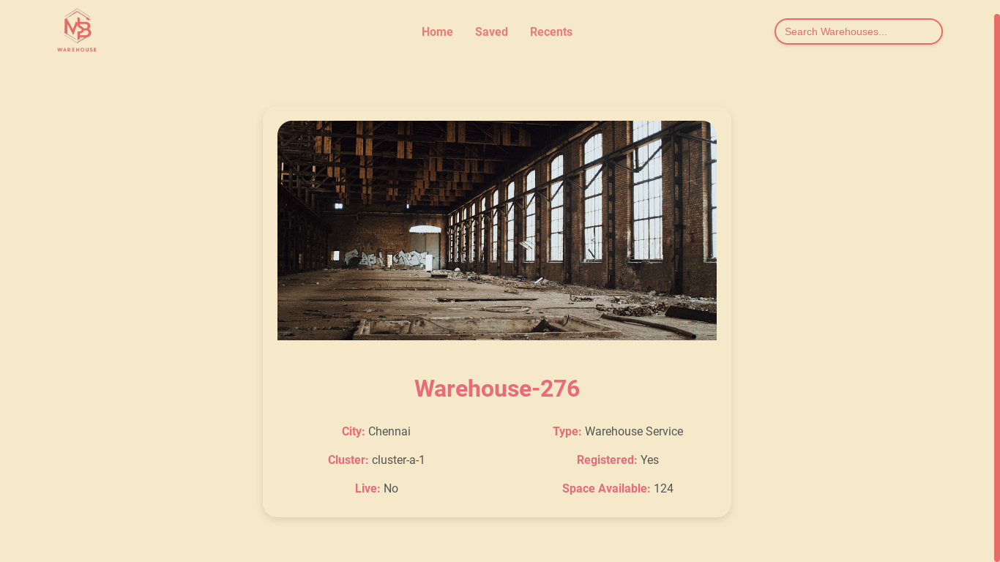

# NSB Warehouse

## Overview

NSB Warehouse is a responsive web application built with Vite, ReactJS, HTML5, JavaScript, and CSS. This application allows users to search for warehouses by name and apply various filters to refine their search results. Users can view detailed information about each warehouse by clicking on an item.

## Features

- **Search Functionality**: Search warehouses by name.
- **Filtering Options**:
  - Filter by city
  - Filter by cluster
  - Filter by space available limit
- **Warehouse Details Page**: Click on any warehouse to view detailed information.
- **Responsive Design**: Works seamlessly on various devices and screen sizes.

## Screenshots


*Warehouse List with Search and Filter Options*


*Filter Options for City, Cluster, and Space Available*


*Warehouse Details Page*


*Recently Viewed Warehouses*


*Saved Warehouses Page*

## Technologies Used

- **Vite**: A fast build tool and development server for modern web applications.
- **ReactJS**: A JavaScript library for building user interfaces.
- **HTML5**: Markup language for structuring web content.
- **JavaScript**: Programming language for interactive web applications.
- **CSS**: Stylesheet language for presentation and layout.

## Installation

1. Clone the repository:
   ```bash
   git clone https://github.com/yourusername/nsb-warehouse.git
    ```
2. Navigate to the project directory:
    ```bash
    cd nsb-warehouse
```
3. Install the dependencies:
```bash 
npm install
```
4. Start the development server:
```bash
npm run dev
```
5. Open your browser and navigate to http://localhost:3000 to view the application.

## Hosted Link

You can view the live application here: []

## Usage
1. Searching for Warehouses:

-Enter the warehouse name in the search bar to find specific warehouses.
2. Filtering Results:

-Use the filter dropdowns to refine your search based on city, cluster, or space available.
3. Viewing Warehouse Details:

-Click on a warehouse from the list to navigate to the details page, where you can view additional information.
 
## Conclusion

NSB Warehouse provides a user-friendly interface for searching and filtering warehouses. Whether you are a warehouse manager or a potential customer, this application helps you find the information you need quickly and efficiently.

For any questions or contributions, please feel free to contact me or open an issue in the repository.